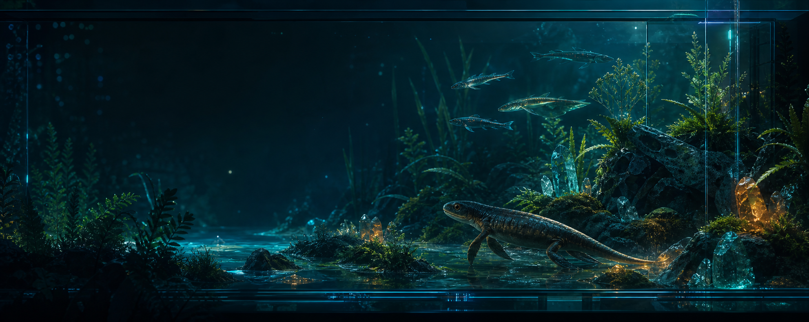
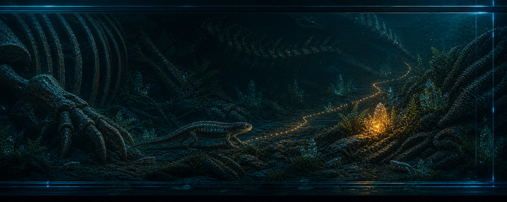

<a href="./README.zh-CN.md">中文</a> · <strong>English</strong>

<h2>🧬 Boyuan Zhou · AI Agent Builder</h2>

I turn model capabilities into usable experiences — from accessible multimodal agents to creative AI workflows and interactive prototypes.

  <code>Computing and Software Systems</code> · <code>Melbourne</code> · <code>AI agent direction</code>

  <a href="https://www.linkedin.com/in/%E5%B8%9B%E8%BF%9C-%E5%91%A8-a88b3834b/">LinkedIn</a> · Feel free to connect

## 🧪 Field notes

I like building at the boundary between model behavior and real interaction:

- **Research** — accessible multimodal agents and VoiceOver-first interaction.
- **Making** — creative AI workflows that turn ideas into comic content and usable outputs.
- **Engineering** — small systems with structured generation, validation, and feedback loops.

## 🦴 Active specimens

### SuperVision

Multimodal accessibility research and an interaction prototype exploring how an AI assistant can support accessible tasks.

### Askread / 问阅绘

A private creative workflow that turns articles and concepts into comic content: **50+ posts published**, including **5 high-engagement posts**.

### Accessible AI Assistant

A SwiftUI prototype designed around VoiceOver-first interaction and confirmation before an AI action.

## 🔬 Other systems

- **RecallGuard / Medical Pantry** — React Native team project for medical-product recall and inventory workflows.
- **EODP — traffic incident severity prediction** — data integration, clustering, and supervised model comparison for traffic-risk analysis.
- **Askread / by-data-cleaning** — a Python service that cleans multilingual articles and returns structured JSON.
- **COMP30023 systems projects** — C implementations covering scheduling and client/server networking.

## 🧰 Field kit

  <strong>Languages</strong> 
  
  
  
  
  
  
  

  <strong>AI · Data · Systems</strong> 
  
  
  
  
  
  

  <strong>Apps · Collaboration</strong> 
  
  
  
  
  
  
  
  

<a href="https://github.com/byby123byby?tab=repositories">Browse the tank specimens → repositories</a>

## 🌿 Outside the tank

Nature, hot springs, board games, financial markets, and turning abstract ideas into things people can see, test, and react to.

Some project code is private while it is being developed with collaborators; coursework repositories are kept separate from the main showcase.
