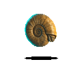

<strong>中文</strong> · <a href="./README.md">English</a>

<h2>🧬 周帛远 · AI 智能体构建者</h2>

我喜欢把模型能力变成真实可用的体验：研究无障碍多模态智能体，也把 AI 工作流做成漫画、工具和交互原型。

  <code>Computing and Software Systems</code> · <code>墨尔本</code> · <code>AI 智能体方向</code>

  <a href="https://www.linkedin.com/in/%E5%B8%9B%E8%BF%9C-%E5%91%A8-a88b3834b/">领英</a> · 欢迎和我互关与链接

## 🧪 研究札记

我关注模型行为和真实交互之间的部分：

- **研究** —— 信息无障碍多模态智能体，以及面向 VoiceOver 的交互设计。
- **创作** —— 将想法转化为漫画内容和可使用输出的 AI 工作流。
- **工程** —— 结构化生成、结果校验和反馈闭环组成的小型系统。

  

## 🦴 当前样本

### SuperVision

信息无障碍多模态智能体科研与交互原型，探索 AI 助手如何支持无障碍任务。

### Askread / 问阅绘

将文章与概念转化为漫画内容的私有工作流：已发布 **50+ 篇内容**，其中 **5 篇达到高互动、高浏览量**。

### Accessible AI Assistant

围绕 VoiceOver 优先交互和 AI 操作确认设计的 SwiftUI 原型。

  

## 🔬 其他系统

- **RecallGuard / Medical Pantry** —— React Native 医疗产品召回与库存流程团队项目。
- **EODP —— 交通事故严重程度预测** —— 面向交通风险分析的数据整合、聚类和监督学习模型比较。
- **Askread / by-data-cleaning** —— 使用 Python 清洗多语言文章并返回结构化 JSON 的服务。
- **COMP30023 系统项目** —— 使用 C 完成调度和客户端/服务器网络相关系统项目。

## 🧰 现场工具箱

  <strong>编程语言</strong> 
  
  
  
  
  
  
  

  <strong>AI · 数据 · 系统</strong> 
  
  
  
  
  
  

  <strong>应用 · 协作</strong> 
  
  
  
  
  
  
  
  

<a href="https://github.com/byby123byby?tab=repositories">浏览生态缸里的样本 → 仓库</a>

## 🌿 生态缸之外

亲近自然、泡温泉、桌游、关注金融市场，也喜欢把抽象想法变成可以被看见、测试和反馈的东西。

部分项目代码因合作开发仍保持私有；课程项目与主要展示项目分开维护。
